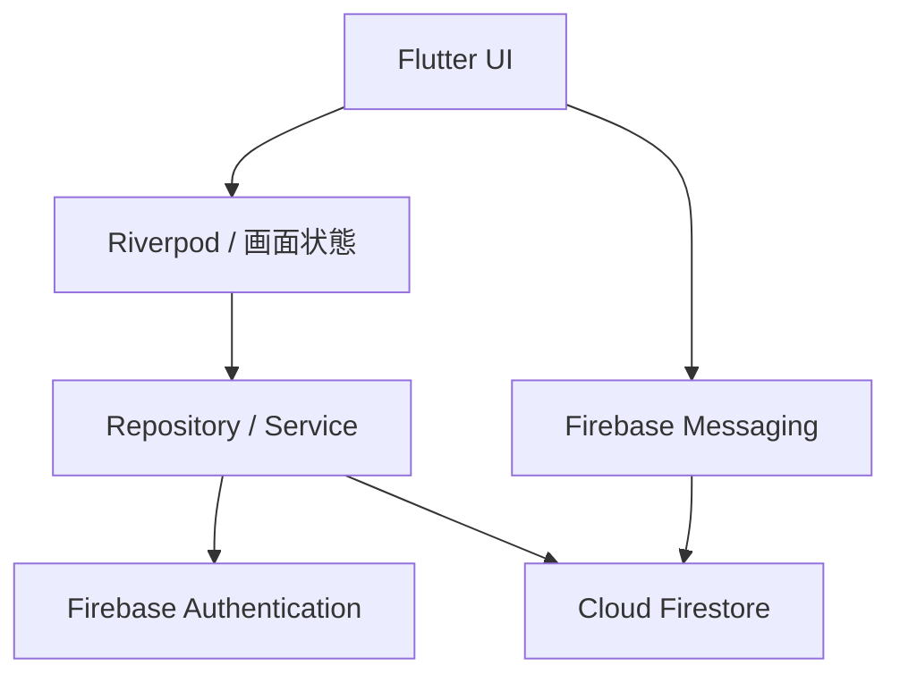
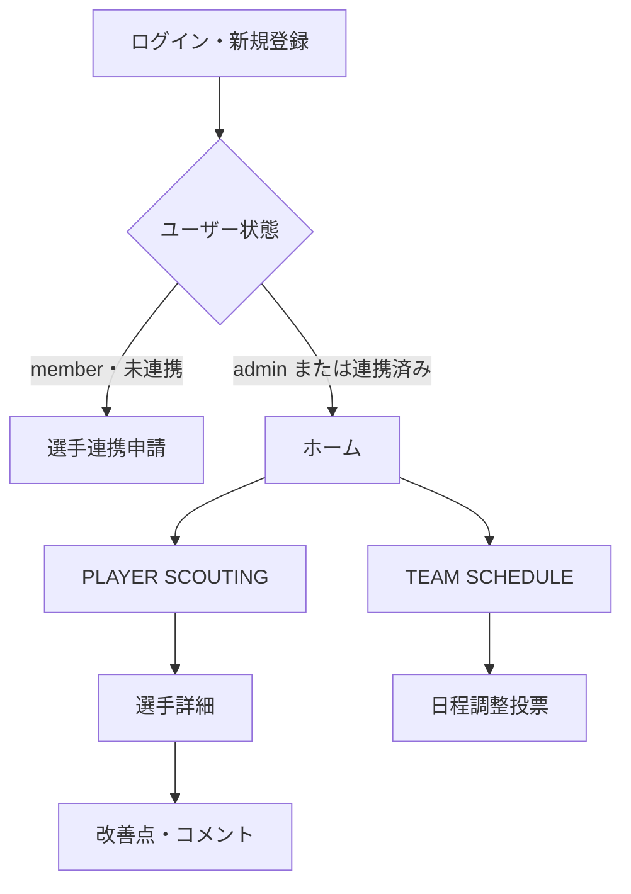

# We's Volleyball Manager 統合仕様書

- 作成日: 2026-07-21
- 対象リポジトリ: `rsktkd2003-afk/we-s-volleyball-manager`
- 対象ブランチ: `main`
- 公開URL: <https://we-s-volleyball-manager.web.app>
- 文書の目的: 現在の実装、合意済みの仕様、今後の構想を一つの資料で把握できるようにする

> 本書は、2026-07-21時点で確認できたGitHub上のコード、既存の「We's Volleyball Manager」説明PDF、2026-07-03作成の新機能要件定義書を統合したものです。Firebase上に現在デプロイされているFirestore Security Rulesなど、リポジトリ外の設定は未確認です。

---

## 1. ステータス表記

| 表記 | 意味 |
|---|---|
| 実装済み | `main`ブランチのコードで実装を確認できた機能 |
| 一部実装 | 基盤または画面の一部はあるが、利用体験が未完成の機能 |
| 計画中 | 既存資料や過去の要件にあるが、実装を確認できていない機能 |
| 要確認 | コードまたは外部設定を確認できず、現状を断定できない項目 |

---

## 2. プロダクト概要

### 2.1 プロダクト名

We's Volleyball Manager

### 2.2 コンセプト

「チームを一つにまとめ、練習を続けたくなる仕組みを作る」

### 2.3 解決したい課題

- LINE上で予定が流れ、練習や試合を見落とす
- 出欠や参加人数を事前に把握しにくい
- 選手情報、能力、予定、目標が分散する
- 選手の強みや成長を感覚ではなくデータで確認したい
- チーム運営の負担を減らし、練習への参加意欲を高めたい

### 2.4 提供価値

- 選手、予定、出欠、お知らせ、目標を一元管理する
- 身体データと能力値から選手の特徴を可視化する
- ポジション適性を参考指標として提示する
- 改善点とコメントを履歴として残す
- 練習試合の候補日を投票で調整し、確定日を予定表へ反映する
- チーム内の共通認識とモチベーションを高める

### 2.5 対象

- 単一チーム運用
- チーム管理者
- チームに所属する選手・メンバー

新規機能では`teamId`を使用しない。既存データに`teamId`が残っている場合も、新規クエリの条件には使用しない方針とする。

---

## 3. システム構成

### 3.1 使用技術

| 分類 | 技術 | 用途 |
|---|---|---|
| UI | Flutter / Dart | Web・Android・Windows共通クライアント |
| 状態管理 | Riverpod | 掲示板、日程調整投票、改善点などの非同期状態管理 |
| 認証 | Firebase Authentication | メールアドレス・パスワード認証 |
| データ | Cloud Firestore | ユーザー、選手、予定、出欠などの保存とリアルタイム同期 |
| 通知基盤 | Firebase Cloud Messaging | 端末トークンの取得・保存 |
| 公開 | Firebase Hosting | Web版の配信 |
| カレンダー | Syncfusion Flutter Calendar | 月表示カレンダー |

`pubspec.yaml`上のアプリバージョンは`1.0.0+1`、Dart SDK条件は`^3.12.1`。

### 3.2 対応環境

- Web
- Android
- Windows

### 3.3 論理構成



---

## 4. ユーザーと権限

### 4.1 ロール

| ロール | 判定方法 | 概要 |
|---|---|---|
| 管理者 | `users/{uid}.role == "admin"` | チーム全体の管理、承認、全件編集などを担当 |
| メンバー | `users/{uid}.role == "member"` | 自分の操作、投稿、投票、出欠回答などを行う |

### 4.2 選手本人の判定

次の関連で本人を判定する。

- `users/{uid}.playerId == playerId`
- `players/{playerId}.linkedUid == uid`

新規登録直後のメンバーは選手データと未連携のため、選手連携申請画面へ移動する。管理者の承認後、ユーザーと選手が相互に紐付く。

### 4.3 権限方針

| 対象 | 閲覧 | 作成 | 編集・削除 |
|---|---|---|---|
| 選手 | 認証済みユーザー | 現行UIでは全員に導線あり | 現行UIでは全員に導線あり。正式な制御は要確認 |
| 予定 | 認証済みユーザー | 認証済みユーザー | 設計上は作成者または管理者 |
| 自分の出欠 | 認証済みユーザー | 本人 | 本人 |
| お知らせ・目標 | 認証済みユーザー | 認証済みユーザー | 作成者または管理者 |
| 日程調整投票 | 認証済みユーザー | 認証済みユーザー | 作成者または管理者。確定は管理者のみ |
| 投票回答 | 認証済みユーザー | 本人 | 本人。確定後は変更不可 |
| 改善点 | 認証済みユーザー | 対象選手本人または管理者 | 作成者または管理者 |
| 改善点コメント | 認証済みユーザー | 認証済みユーザー | 作成者または管理者 |

> 重要: リポジトリ直下に`firestore.rules`を確認できませんでした。上表は画面コードと既存要件から整理した権限方針です。実際の防御はFirestore Security Rulesで必ず一致させる必要があります。

---

## 5. 画面構成と遷移



### 5.1 ログイン・新規登録画面

- メールアドレスとパスワードを入力する
- 同一画面内でログインと新規登録を切り替える
- 新規登録時はFirebase Authenticationにユーザーを作成する
- `users/{uid}`が存在しない場合は次の初期値で作成する
  - `email`
  - `displayName`: 現状はFirebase Authの値。通常は空文字
  - `role`: `member`
  - `playerId`: `null`
  - `createdAt`, `updatedAt`
- ユーザーネームを入力する専用欄は未実装

### 5.2 選手連携申請画面

- 未連携の選手一覧から自分を選ぶ
- `player_link_requests`へ申請を作成する
- 申請中は重複申請を禁止する
- 管理者承認時に、トランザクションで以下を更新する
  - `users/{uid}.playerId`
  - `players/{playerId}.linkedUid`
  - 申請の`status`, `reviewedAt`, `reviewedBy`

### 5.3 ホーム画面

- ヘッダーにアプリ名と通知・設定・プロフィールのアイコンを表示する
- 上部タブで次の2画面を切り替える
  - `PLAYER SCOUTING`
  - `TEAM SCHEDULE`
- 通知・設定・プロフィールのアイコンは表示済みだが、現行ホーム画面では操作が接続されていない

---

## 6. 機能仕様

## 6.1 認証・アカウント

| ID | 要件 | 状態 |
|---|---|---|
| AUTH-001 | メールアドレスとパスワードで新規登録できる | 実装済み |
| AUTH-002 | メールアドレスとパスワードでログインできる | 実装済み |
| AUTH-003 | 初回ログイン時に`users/{uid}`を作成または不足項目を補完する | 実装済み |
| AUTH-004 | 未連携メンバーを選手連携画面へ誘導する | 実装済み |
| AUTH-005 | 新規登録時にユーザーネームを入力し、AuthとFirestoreへ保存する | 計画中 |
| AUTH-006 | プロフィール編集・ログアウト・設定画面を提供する | 計画中 |

## 6.2 選手管理

### 6.2.1 選手一覧

| ID | 要件 | 状態 |
|---|---|---|
| PLAYER-001 | Firestoreの選手一覧をリアルタイム表示する | 実装済み |
| PLAYER-002 | 名前で検索する | 実装済み |
| PLAYER-003 | 学年で絞り込む | 実装済み |
| PLAYER-004 | ポジションで絞り込む | 実装済み |
| PLAYER-005 | 背番号・学年・名前で並び替える | 実装済み |
| PLAYER-006 | 新しい選手を追加する | 実装済み |
| PLAYER-007 | スマホではカード情報を背番号・名前・ポジション中心に簡略化する | 実装済み |
| PLAYER-008 | PCでは3列、スマホでは幅に応じて1〜2列表示する | 実装済み |

### 6.2.2 選手データ

| 分類 | 項目 |
|---|---|
| 識別・権限 | `id`, `ownerUid`, `linkedUid` |
| 基本情報 | 名前、背番号、ポジション、利き手、学年 |
| 身体データ | 身長、体重、指高、最高到達点、ブロック到達点 |
| 能力値 | スパイク、サーブ、レセプション、ディグ、トス、ブロック、機動力 |
| 内部パラメータ | ジャンプ、パワー、スピード、スタミナ、ゲームセンス |
| 役職 | キャプテン、副キャプテン、SNS係、連絡係、体育館予約係、練習リーダー |

- 能力値は編集時に1〜10へ丸める
- ジャンプ高は`最高到達点 - 指高`で算出する
- 内部パラメータはモデルに存在するが、現在の選手編集画面では編集せず既存値を保持する

### 6.2.3 選手詳細

- スカウトカード表示
- 身体データと能力値の表示
- 能力レーダーチャート
- ポジション適性の表示
- 役職アイコン表示
- 選手編集・削除
- 改善点タブ

### 6.2.4 ポジション適性

対象ポジションは`WS`、`MB`、`S`、`OP`、`L`。

身体データは次の線形スコアへ変換し、0〜10へ制限する。

- 身長: 170cmを4点、190cmを10点として線形変換
- 最高到達点: 300cmを4点、330cmを10点として線形変換

現在の重み付けは次のとおり。

| ポジション | 計算式 |
|---|---|
| WS | スパイク30% + レセプション25% + ディグ15% + 最高到達点15% + サーブ10% + 機動力5% |
| OP | スパイク40% + 最高到達点20% + ブロック15% + サーブ15% + ディグ10% |
| MB | ブロック45% + 最高到達点20% + 身長10% + 機動力25% |
| S | トス40% + ディグ20% + 機動力20% + ブロック10% + サーブ10% |
| L | レセプション40% + ディグ35% + 機動力15% + サーブ10% |

左利きの選手は、現在の実装ではOPスコアへ`5`を加算する。ほかのスコアが概ね0〜10であるため、この加点幅が意図どおりかは要確認。

### 6.2.5 改善点・コメント

| ID | 要件 | 状態 |
|---|---|---|
| ISSUE-001 | 選手本人または管理者が改善点を追加する | 実装済み |
| ISSUE-002 | 改善点を新しい順に最大50件表示する | 実装済み |
| ISSUE-003 | 作成者または管理者が改善点を編集・削除する | 実装済み |
| ISSUE-004 | 認証済みユーザーがコメントする | 実装済み |
| ISSUE-005 | コメントを古い順に最大100件表示する | 実装済み |
| ISSUE-006 | 作成者または管理者がコメントを編集・削除する | 実装済み |

- 改善点は最大2,000文字
- コメントは最大1,000文字
- 削除は物理削除ではなく`deletedAt`を設定するソフトデリート
- 編集前の内容を版として保存する編集履歴は未実装

## 6.3 予定・出欠管理

### 6.3.1 カレンダー

- 月表示を基本とする
- 週の開始曜日は月曜日
- 予定タイトルに応じて表示色を変える
  - ウェイト: ピンク
  - 試合・公式戦・大会: 黄色
  - その他: 青
- 予定をタップすると詳細ボトムシートを開く
- スマホではカレンダーに620pxの固定表示高を確保する
- PC・タブレットではカレンダーとメモ・目標を横並びにする

### 6.3.2 予定登録

| ID | 要件 | 状態 |
|---|---|---|
| SCHEDULE-001 | タイトル、場所、日付、開始時刻、所要時間を登録する | 実装済み |
| SCHEDULE-002 | 単発・毎日・毎週・毎月の繰り返しを指定する | 実装済み |
| SCHEDULE-003 | 一度に1〜20件を作成する | 実装済み |
| SCHEDULE-004 | タイトル・場所・所要時間をテンプレート保存する | 実装済み |
| SCHEDULE-005 | テンプレートを読み込み・削除する | 実装済み |
| SCHEDULE-006 | 予定のタイトル・場所・日付・開始時刻を編集する | 実装済み |
| SCHEDULE-007 | 作成者または管理者が予定を削除する | 実装済み |

所要時間の選択肢は60、90、120、150、180、240分。編集時は既存の所要時間を維持する。

### 6.3.3 出欠

- 選択肢: 参加、遅刻、欠席
- 遅刻時は到着予定時刻または「未定」を保存する
- ユーザーごとに`responses/{uid}`へ上書き保存する
- 自分の回答を削除できる
- 参加・遅刻・欠席の人数を集計する
- 回答者名、状態、遅刻時刻を一覧表示する

現行コードは回答データの`playerId`へユーザーUIDを保存している。`users/{uid}.playerId`にある実際の選手IDとは意味が異なるため、フィールド名または保存値の整理が必要。

## 6.4 お知らせ・今月の目標

### 6.4.1 お知らせ

- 最大50件を新しい順に取得する
- ピン留めを先頭にしてクライアント側で並び替える
- タイトル必須、最大50文字
- 本文任意、最大500文字
- 認証済みユーザーは作成できる
- 作成者または管理者は編集・削除できる

### 6.4.2 今月の目標

- `monthKey`を`YYYY-MM`形式で保存する
- カレンダーで表示中の月に合わせて最大50件を取得する
- `sortOrder`、作成日時の順で表示する
- タイトル必須、最大50文字
- 本文任意、最大500文字
- 認証済みユーザーは作成できる
- 作成者または管理者は編集・削除できる

### 6.4.3 表示

- 予定画面のサイドまたは下部に、最新のお知らせ最大5件をMEMOとして表示する
- 表示中の月の目標先頭1件を付箋として表示する
- 掲示板エリアでは、お知らせと目標を付箋の一覧として表示する

## 6.5 練習試合の日程調整投票

| ID | 要件 | 状態 |
|---|---|---|
| POLL-001 | 認証済みユーザーが投票を作成する | 実装済み |
| POLL-002 | タイトル、メモ、1件以上の候補日時・場所を登録する | 実装済み |
| POLL-003 | 各候補へ○・△・×で回答する | 実装済み |
| POLL-004 | △の場合だけ最大200文字のコメントを保存する | 実装済み |
| POLL-005 | 候補ごとの回答人数と回答者を表示する | 実装済み |
| POLL-006 | 本人が回答を上書き変更する | 実装済み |
| POLL-007 | 管理者が候補日を確定する | 実装済み |
| POLL-008 | 確定日を予定へ同時登録する | 実装済み |
| POLL-009 | 確定後の回答変更を禁止する | 実装済み |
| POLL-010 | 作成者または管理者が投票を削除する | 実装済み |
| POLL-011 | 作成後に投票内容を編集する画面を提供する | 一部実装 |

- タイトルは最大50文字
- メモは最大300文字
- 終了日時は開始日時より後でなければならない
- 回答は`votes/{uid}`に保存し、1ユーザー1ドキュメントとする
- 確定時はFirestoreのバッチ処理で、予定作成と投票状態更新を同時に行う
- 削除は`status = "deleted"`にするソフトデリート。回答データは保持する
- 確定後の取り消し機能は未実装

## 6.6 通知

| ID | 要件 | 状態 |
|---|---|---|
| NOTIFY-001 | ログイン後に通知権限を要求する | 一部実装 |
| NOTIFY-002 | FCMトークンを`users/{uid}/fcmTokens/{token}`へ保存する | 実装済み |
| NOTIFY-003 | トークン更新時に保存値を更新する | 実装済み |
| NOTIFY-004 | 予定の前日20:00に通知する | 計画中 |
| NOTIFY-005 | 予定の1時間前に通知する | 計画中 |
| NOTIFY-006 | お知らせ作成時にメンバーへ通知する | 計画中 |
| NOTIFY-007 | アプリ内通知一覧と未読管理を提供する | 計画中 |

現在確認できるのはクライアント側のトークン登録まで。通知を送信・予約するCloud Functions等は確認できていない。

---

## 7. Firestoreデータ構造

## 7.1 トップレベルコレクション

| コレクション | 主な用途 |
|---|---|
| `users` | アカウント、ロール、選手連携先 |
| `players` | 選手プロフィール、身体データ、能力値、役職 |
| `player_link_requests` | ユーザーと選手の連携申請 |
| `schedules` | 練習・試合などの予定 |
| `schedule_templates` | 予定登録テンプレート |
| `announcements` | チームのお知らせ |
| `goals` | 月ごとのチーム目標 |
| `match_polls` | 練習試合の日程調整投票 |

## 7.2 `users/{uid}`

| フィールド | 型 | 内容 |
|---|---|---|
| `email` | string | メールアドレス |
| `displayName` | string | 表示名 |
| `role` | string | `admin`または`member` |
| `playerId` | string / null | 連携済み選手ID |
| `createdAt` | timestamp | 作成日時 |
| `updatedAt` | timestamp | 更新日時 |

サブコレクション:

- `fcmTokens/{token}`: `token`, `platform`, `updatedAt`

## 7.3 `players/{playerId}`

主要フィールド:

- `ownerUid`, `linkedUid`
- `name`, `number`, `position`, `dominantHand`, `grade`
- `height`, `weight`, `standingReach`, `maxReach`, `blockReach`
- `spike`, `serve`, `reception`, `dig`, `toss`, `block`, `mobility`
- `jump`, `power`, `speed`, `stamina`, `gameSense`
- `roles`: string配列

サブコレクション:

- `issues/{issueId}`
  - `playerId`, `content`, `createdBy`, `createdByName`, `createdAt`, `updatedAt`, `deletedAt`
- `issues/{issueId}/comments/{commentId}`
  - `content`, `createdBy`, `createdByName`, `createdAt`, `updatedAt`, `deletedAt`

## 7.4 `player_link_requests/{requestId}`

- `uid`
- `playerId`
- `playerName`
- `displayName`
- `status`: `pending` / `approved` / `rejected`
- `createdAt`
- `reviewedAt`
- `reviewedBy`

## 7.5 `schedules/{scheduleId}`

- `title`
- `location`
- `start`
- `end`
- `durationMinutes`
- `createdBy`

サブコレクション`responses/{uid}`:

- `uid`
- `playerId`
- `playerName`
- `status`: `参加` / `遅刻` / `欠席`
- `lateTime`
- `updatedAt`

## 7.6 `schedule_templates/{templateId}`

- `title`
- `location`
- `durationMinutes`

## 7.7 `announcements/{announcementId}`

- `title`
- `body`
- `sortOrder`
- `isPinned`
- `createdBy`
- `createdAt`
- `updatedAt`

## 7.8 `goals/{goalId}`

- `monthKey`
- `title`
- `body`
- `sortOrder`
- `createdBy`
- `createdAt`
- `updatedAt`

## 7.9 `match_polls/{pollId}`

- `title`
- `note`
- `candidates`: 配列
  - `id`
  - `start`
  - `end`
  - `location`
- `status`: `open` / `confirmed` / `deleted`
- `confirmedCandidateId`
- `confirmedScheduleId`
- `createdBy`
- `createdAt`
- `updatedAt`

サブコレクション`votes/{uid}`:

- `uid`
- `displayName`
- `answers`: 候補IDをキーにしたMap
  - `choice`: `ok` / `maybe` / `ng`
  - `comment`
- `updatedAt`

---

## 8. UI・レスポンシブ仕様

### 8.1 デザイン方針

- コルクボード、紙、付箋、ピン、テープを使ったチーム掲示板風UI
- ヘッダーは濃色、アクセントは赤、コンテンツは紙色を基本とする
- 選手カードはスカウト資料風に表示する
- 予定はカレンダーと掲示板を一つの画面にまとめる

### 8.2 主なブレークポイント

| 対象 | 条件 | 動作 |
|---|---|---|
| 選手カード | 600px未満 | 簡略表示、幅に応じて1〜2列 |
| 選手一覧 | 900px以上 | 選手グリッドとフィルターを横並び |
| 選手詳細 | 700px以上 | タブレット向けレイアウト |
| 選手詳細 | 1100px以上 | デスクトップ向けレイアウト |
| 予定画面 | 600px未満 | 縦積み、カレンダー固定高620px |
| 予定画面 | 600px以上 | カレンダー左、メモ・目標右 |

---

## 9. 非機能要件

### 9.1 データ同期

- 選手、予定、出欠、お知らせ、目標、投票、改善点はFirestoreからリアルタイム取得する
- ストリーム取得エラーはログだけで黙殺せず、利用者へ表示する

### 9.2 セキュリティ

- 未認証ユーザーにアプリデータを公開しない
- UIの表示制御だけでなくFirestore Security Rulesで操作権限を強制する
- `role`、`createdBy`、`linkedUid`、ドキュメントIDとしての`uid`を使って権限判定する
- 秘密情報、Firebaseの機密値、トークンをリポジトリやログへ出さない

### 9.3 保守性

- Firestoreコレクション名は`FirestoreCollections`へ集約する
- Firestoreアクセスは可能な限りRepositoryまたはServiceへ集約する
- Riverpodを使用してストリームと画面を分離する
- 既存機能、UI、データ構造、認証、権限、レスポンシブ対応を壊さない範囲で段階的に変更する

### 9.4 パフォーマンス

- お知らせ、目標、投票、改善点には取得上限を設定する
- 不要な複合インデックス依存を避ける
- 親ドキュメントを削除してもFirestoreのサブコレクションは自動削除されない点を考慮する

---

## 10. 現在の注意点・未確定事項

優先度が高い順に記載する。

### 10.1 Firestore Security Rulesをリポジトリで確認できない

- リポジトリ直下に`firestore.rules`がない
- 現在デプロイされているルールと、UI上の権限制御が一致しているか確認できない
- 特に選手の追加・編集・削除、予定編集はクライアント側の表示制御が弱い

推奨: 現行ルールを確認し、テスト付きでリポジトリ管理する。

### 10.2 選手管理のクライアント権限

- 選手追加カードは全ログインユーザーに表示される
- 選手詳細の編集・削除ボタンも常に表示される
- Firestore Rulesが拒否する場合でも、利用者には操作可能に見える

推奨: 管理者、作成者、選手本人のどこまで許可するか確定し、UIとRulesを一致させる。

### 10.3 新規登録時の表示名

- ユーザーネーム入力欄がない
- コメント、投票、出欠の表示名が空の場合、メールアドレスが表示される可能性がある

推奨: 新規登録時に表示名を必須入力し、Firebase Authと`users/{uid}.displayName`へ保存する。

### 10.4 出欠の`playerId`

- 現行実装では`playerId`へユーザーUIDを保存する
- 選手ドキュメントIDを指すように見える名称と実データが一致していない

推奨: 実際の選手IDを保存するか、`userUid`へ改名する。

### 10.5 通知は送信側が未実装

- FCMトークン登録はある
- 予定前通知、お知らせ通知、アプリ内通知一覧は未実装

### 10.6 ヘッダー操作が未接続

- 通知、設定、プロフィールのアイコンは表示される
- 現行ホーム画面ではコールバックが渡されず、押せない
- ログアウト導線も確認できない

### 10.7 ポジション適性の左利き補正

- 左利きの場合、OPへ5点を加算する
- 他の適性スコアとの尺度が変わるため、意図した加点か要確認

### 10.8 READMEが現在の実装より古い

READMEには、次の実装済み機能が十分に反映されていない。

- お知らせ・今月の目標
- 日程調整投票
- 改善点・コメント
- 選手連携申請
- 役職アイコン
- FCMトークン登録
- 現在のコルクボードUIとレスポンシブ仕様

---

## 11. 今後の構想

| 優先度 | 機能 | 概要 | 状態 |
|---|---|---|---|
| 1 | 認証・権限の完成 | 表示名、ログアウト、Rules、管理権限を整える | 計画中 |
| 2 | 通知 | 前日20:00、1時間前、お知らせ作成時などに通知する | 計画中 |
| 3 | 成長グラフ | 到達点や能力値の変化を時系列で表示する | 計画中 |
| 4 | 練習メニュー管理 | 目的、必要人数、伸ばす能力を一覧化する | 計画中 |
| 5 | 当日の練習内容共有 | 参加予定者へ練習メニューを事前共有する | 計画中 |
| 6 | 練習メニューレコメンド | 人数、ポジション、苦手傾向から練習を提案する | 計画中 |
| 7 | シーズン振り返り | 最多出席、最多成長、MVPなどを自動集計する | 計画中 |
| 8 | AIコーチ | 身体・能力データから改善点と練習を提案する | 計画中 |

---

## 12. 開発・確認フロー

### 12.1 作業開始

```powershell
git switch main
git pull --ff-only
git status
git switch -c feature/<short-name>
```

### 12.2 変更後の確認

```powershell
flutter pub get
flutter analyze
flutter test
flutter build web
git status
git diff
```

### 12.3 Web版のデプロイ

Pull Requestをmainへマージし、対象Firebaseプロジェクトを確認した後に実行する。

```powershell
firebase use we-s-volleyball-manager
flutter build web
firebase deploy --only hosting
```

デプロイはコード変更・マージとは分け、明示的な確認後に行う。

---

## 13. 完了条件の共通ルール

機能追加・修正は、次を満たした時点で完了とする。

1. 仕様と権限の確認が済んでいる
2. 既存機能とデータ構造を壊していない
3. スマホ・PCの両方でレイアウトを確認している
4. Firestore変更時はRulesと必要なインデックスを確認している
5. `flutter analyze`が成功している
6. 関連テストが成功している
7. `flutter build web`が成功している
8. 意図しない差分がない
9. PRレビューとCIが完了している
10. デプロイ後に公開版を確認している

---

## 14. 更新ルール

- 実装を変更した場合は、同じPull Requestで本仕様書も更新する
- 「実装済み」「一部実装」「計画中」を必ず更新する
- Firestoreのフィールド、権限、画面遷移、計算式の変更は履歴に残す
- 実装と仕様が異なる場合、現状を隠さず差異として記載する

### 変更履歴

| 日付 | 内容 |
|---|---|
| 2026-07-21 | 初版作成。現行`main`、既存説明PDF、新機能要件定義を統合 |
